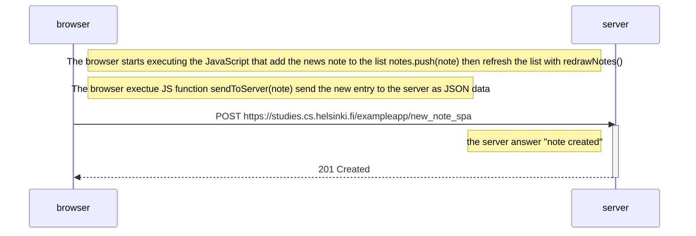

```mermaid
sequenceDiagram
    participant browser
    participant server


    Note right of browser: The browser starts executing the JavaScript that add the news note to the list notes.push(note) then refresh the list with redrawNotes()
    Note right of browser: The browser exectue JS function sendToServer(note) send the new entry to the server as JSON data
    browser->>server: POST https://studies.cs.helsinki.fi/exampleapp/new_note_spa
    activate server
    Note left of server: the server answer "note created"
    server-->>browser: 201 Created
    deactivate server


```
